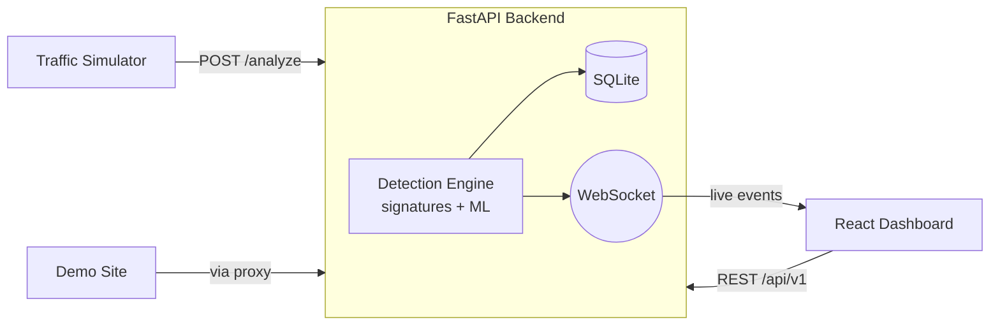

# 🛡️ ACSTD — AI Cyber Security Threat Detector

A defensive web-security monitor that inspects incoming HTTP requests in real
time, classifies them as **SAFE** or a specific **THREAT** (SQL injection, XSS,
path traversal, command injection, suspicious user-agent, rate abuse), stores
them, scores a confidence level, and streams them live to an analyst dashboard
where they can be **blocked** or **ignored**.

> Built as an internship/student demo. It favours clarity over scale and is
> honest about its limits — see [Disclaimers](#disclaimers) and
> [`PRODUCTION_CHECKLIST.md`](PRODUCTION_CHECKLIST.md).


## Features

- **Hybrid detection** — fast regex **signatures** + a **TF-IDF / ML** model for
  obfuscated or novel payloads, combined into one verdict + confidence.
- **Real-time dashboard** — live threat feed over WebSocket, stats, charts,
  filters, CSV export, light/dark themes.
- **Inline inspecting proxy** — sits in front of a target site, blocks threats,
  forwards safe traffic.
- **Operational API** — `/health`, `/health/ready`, `/version`, `/metrics`,
  fully documented in Swagger.
- **Traffic simulator** — synthetic SQLi / XSS / path / command / rate-abuse /
  port-scan traffic to drive the demo.

## Architecture (high level)



Full diagrams: [`docs/ARCHITECTURE.md`](docs/ARCHITECTURE.md).

## Quickstart

### Docker (whole stack)

```bash
docker compose up --build
```
- Dashboard → http://localhost:5173
- API + Swagger → http://localhost:8000/docs
- Demo site (via proxy) → http://localhost:8000/api/v1/proxy/login?demo=true

### Manual (dev)

```bash
# backend
cd backend && pip install -r requirements.txt && python train.py
uvicorn app.main:app --reload          # http://localhost:8000

# frontend (new terminal)
cd frontend && npm install && npm run dev   # http://localhost:5173
```

Detailed steps: [`docs/INSTALL.md`](docs/INSTALL.md) ·
Demo script: [`docs/DEMO.md`](docs/DEMO.md).

## Documentation

| Doc | Purpose |
|---|---|
| [`docs/INSTALL.md`](docs/INSTALL.md) | Install (manual, Docker, Hugging Face) |
| [`docs/DEMO.md`](docs/DEMO.md) | 5-minute demo walkthrough |
| [`docs/ARCHITECTURE.md`](docs/ARCHITECTURE.md) | Diagrams + request flow |
| [`docs/API.md`](docs/API.md) | Endpoint reference + examples |
| [`docs/PERFORMANCE.md`](docs/PERFORMANCE.md) | Tuning + scaling notes |
| [`PRODUCTION_CHECKLIST.md`](PRODUCTION_CHECKLIST.md) | Production-readiness status |

## Tech stack

**Backend** FastAPI · Uvicorn · SQLite · scikit-learn · pandas · httpx ·
pydantic-settings  ·  **Frontend** React 18 · Vite 5 · Tailwind 3 · Recharts ·
Framer Motion  ·  **Real-time** WebSockets.

## Screenshots

Add captures to [`docs/screenshots/`](docs/screenshots/) — see that folder's
README for the recommended shots (dashboard, live detection, block action,
Swagger UI).

## Disclaimers

- The bundled binary model was trained on a **SQLi dataset**, so it is strongest
  on SQLi; other classes lean on signatures. A multi-class model exists but is
  not wired in. Detection is honest about this rather than overclaiming.
- Signatures catch textbook attacks but are bypassable by heavy obfuscation.
- "Scalable" here means stateless workers + a real DB option — not production
  traffic. See the checklist for known gaps (in-memory state, hard-coded
  frontend host, secrets hygiene).

## License

MIT.
