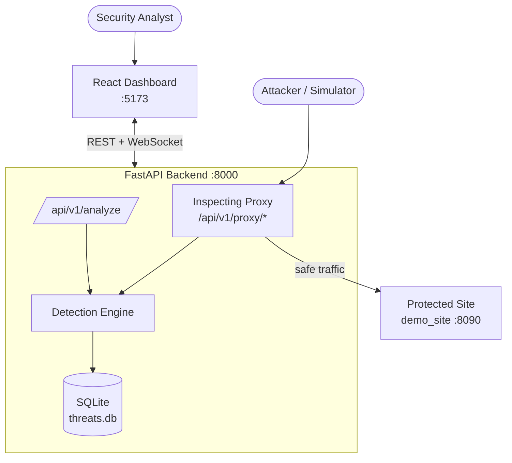
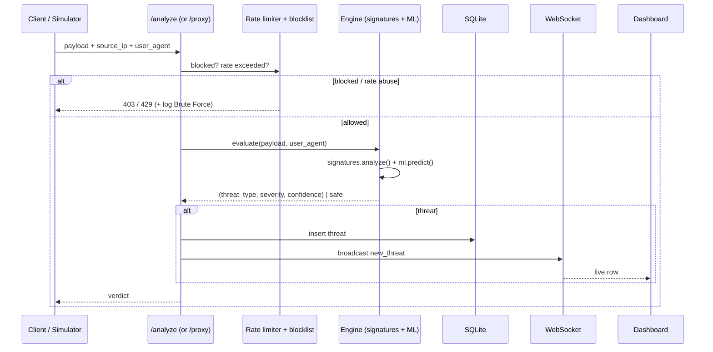
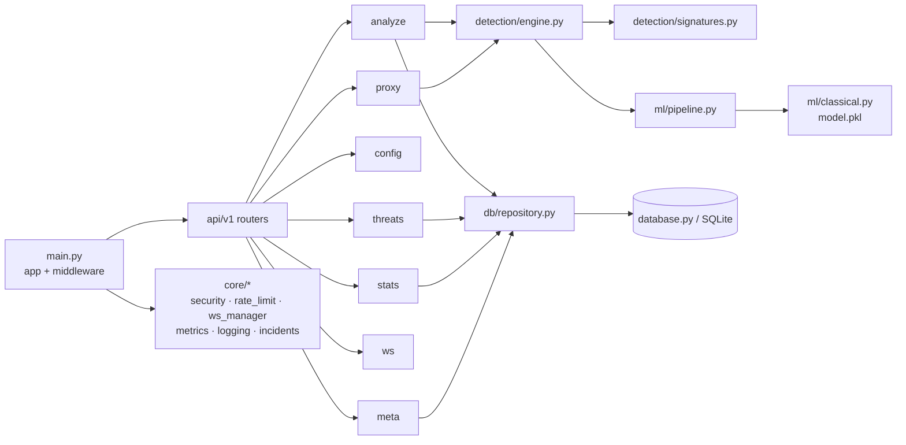
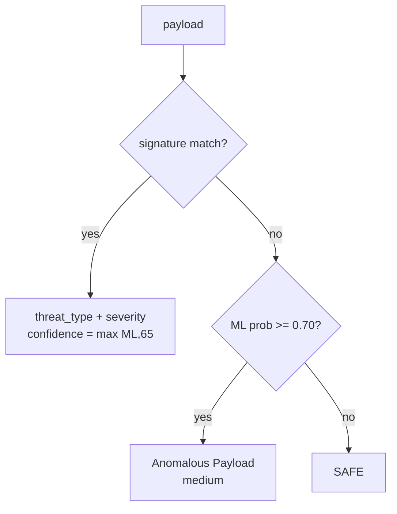
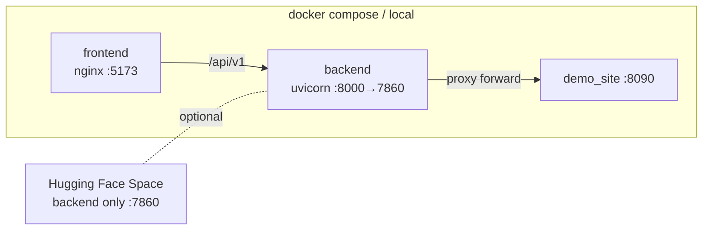

# Architecture

## 1. System context

## 2. Request flow (detection)

## 3. Backend components

## 4. Detection pipeline (verdict precedence)

Signature rules are evaluated first-match in order **SQLi → XSS → Path Traversal
→ Command Injection → Suspicious User-Agent**, then the ML model. See
[API.md](API.md) for the resulting `threat_type` values.

## 5. Deployment topology

